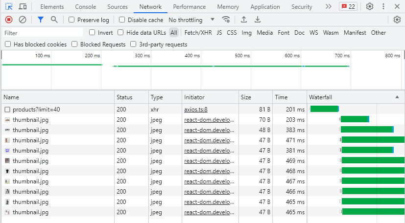
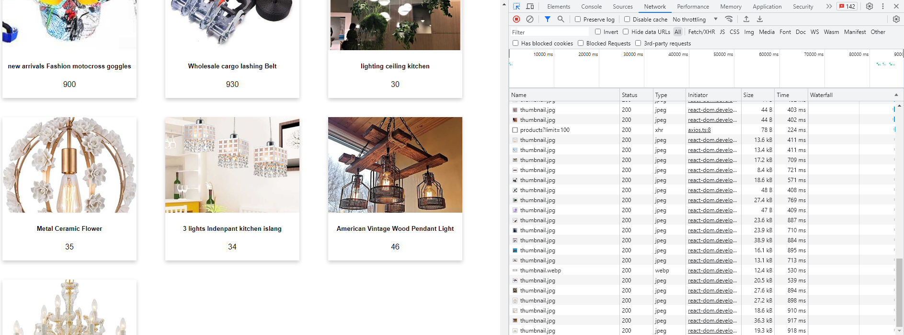
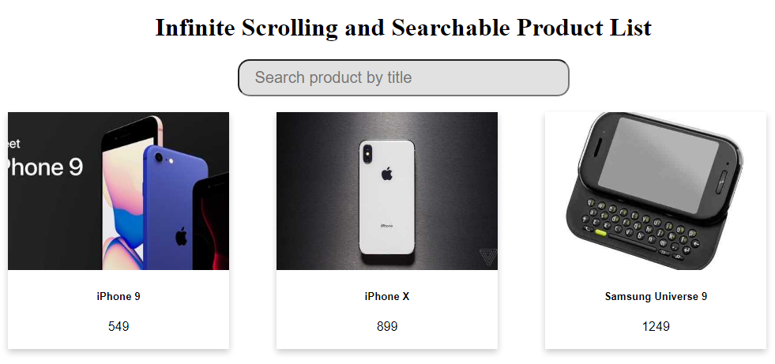
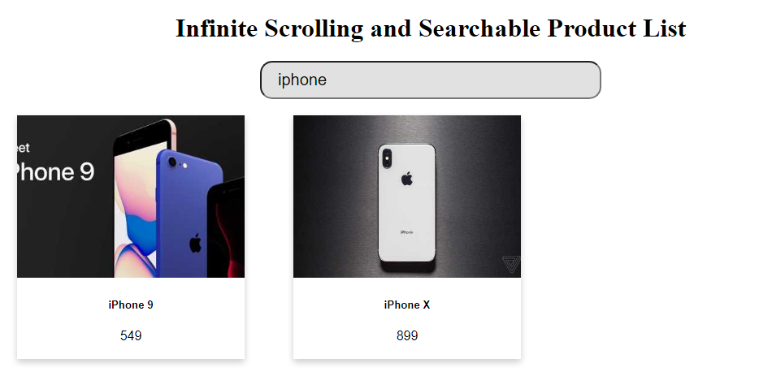

# infinite-scrolling-and-search
Infinite Scrolling and Searchable Product List

# Getting Started Project

## Install packages

### `yarn`

## Start Project
In the project directory, you can run:

### `yarn dev`

Runs the app in the development mode.\
Open [http://127.0.0.1:5173/](http://127.0.0.1:5173/) to view it in your browser.

The page will reload when you make changes.\

### Solution to implement Infinite Scrolling with *Intersection Observer API*

The *Intersection Observer API* can observe whether an element is visible, so when using it to complete infinite scrolling, need to add an element to the bottom of the list. When the element is visible, load more content.

Then observe the element by using *Intersection Observer API*, when the element is visible load the next20 items:

```javascript
    const lastPostRef = useCallback((product: HTMLElement) => {
        if (isLoading) return

        if (intObserver.current) intObserver.current.disconnect()

        intObserver.current = new IntersectionObserver(products => {
            if (products[0].isIntersecting && hasNextPage) {
                setLimit(prev => prev + 10)
            }
        })

        if (product) intObserver.current.observe(product)
    }, [isLoading, hasNextPage])
```

### Solution to implement Searchable Product List

I use useDebounce when user search name of product in search function to avoid rerender component and call API consecutive.

```javascript
    const { type, placeholder, fetchSearch } = props;

    const [value, setValue] = useState<string>('');
    const debouncedValue = useDebounce<string>(value, 300);

    const handleChange = (event: ChangeEvent<HTMLInputElement>) => {
        const valueSearch = event.target.value;
        setValue(valueSearch);
    };

    useEffect(() => {
        fetchSearch(debouncedValue);
    }, [debouncedValue]);
```

### How to test Infinite Scrolling

1. Scroll to the bottom and see products will be loaded. Check tab network



2. Scroll will stop when load 100 product



### How to test Searchable Product List

1. Type name of product that you want to search into input search



2. See the result

